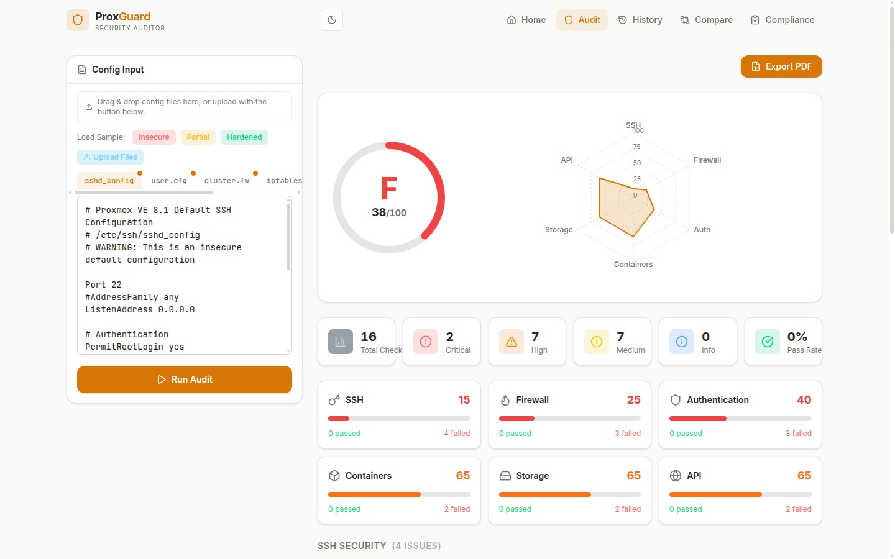

<p align="center">
  
</p>

<h1 align="center">ProxGuard</h1>

<p align="center"><strong>Proxmox VE security auditor with CIS Benchmark-backed scoring, conflict detection, and auto-generated remediation scripts.</strong></p>

<p align="center">
  
  
  
</p>

ProxGuard parses your actual Proxmox configuration files (sshd_config, cluster.fw, user.cfg, storage.cfg, API tokens) and grades your security posture across six categories. Every rule traces back to a CIS Benchmark or Proxmox-specific security standard. Failed checks include remediation steps and copy-paste shell scripts to fix the issue.

It also visualizes firewall rules with drag-drop reordering and automatic conflict detection, so you can see shadowing, contradictions, and unreachable rules before they cause problems.



---

## Features

- **Security Audit Engine** - Paste config files, get a letter grade with detailed findings
- **CIS Benchmark Rules** - 16 rules mapped to CIS Debian 11 and Proxmox security standards
- **Remediation Scripts** - Every failed check includes copy-paste shell commands to fix the issue
- **Firewall Visualization** - Flat list view of all rules with color-coded direction indicators
- **Drag-Drop Reordering** - Reorder rules by dragging, see impact on priority instantly
- **Conflict Detection** - 5 types: shadowing, contradictions, unreachable, port overlap, protocol mismatch
- **Audit Trail** - Immutable changelog showing who changed what and when
- **Inline Editing** - Edit rule properties (direction, protocol, port, action) in-place
- **Bulk Operations** - Enable/disable multiple rules, delete groups
- **Search & Filter** - Find rules by IP, port, protocol, or action
- **5 Visual Themes** - Tactical, Analyst, Terminal, Command, Cyber
- **Rule Import/Export** - Backup and restore firewall configs
- **Offline-First** - All processing happens in the browser, no data leaves your machine

---

## Quick Start

```bash
git clone https://github.com/lidless-labs/proxguard.git
cd proxguard
npm install
npm run dev
```

Open **http://localhost:5190**

---

## Running an Audit

1. Navigate to the **Audit** tab
2. Paste your Proxmox config files:
   - `/etc/ssh/sshd_config` (SSH hardening)
   - `/etc/pve/firewall/cluster.fw` (firewall rules)
   - `/etc/pve/user.cfg` (users, roles, 2FA)
   - `/etc/pve/storage.cfg` (NFS/CIFS mounts)
   - API token list (`pveum apitoken list`)
3. ProxGuard parses each file, runs all 16 rules, and generates your report
4. Click any finding for details, CIS reference, and remediation script

No data is sent anywhere. The entire audit runs client-side in your browser.

---

## How the Scoring Works

ProxGuard runs 16 security rules across 6 categories. Each category has a weight reflecting its risk to a Proxmox environment:

| Category | Weight | What It Checks |
|----------|--------|----------------|
| **SSH** | 25% | Root login, password auth, default port, max auth tries |
| **Firewall** | 25% | Cluster firewall enabled, default policies, rule existence |
| **Authentication** | 20% | 2FA enrollment, root API tokens, overpermissive roles |
| **Container** | 15% | Privileged containers, nesting enabled |
| **Storage** | 10% | NFS root_squash, CIFS permissions |
| **API** | 5% | Admin token privileges, token expiration |

SSH and Firewall are weighted heaviest because they're the most common attack surface on internet-facing Proxmox hosts.

### Deductions

Each failed rule deducts from its category score based on severity:

| Severity | Deduction | Example |
|----------|-----------|---------|
| **Critical** | -40 | Root SSH with password auth enabled |
| **High** | -25 | No 2FA on any user account |
| **Medium** | -10 | SSH on default port 22 |
| **Info** | -5 | Advisory findings |

Category scores are weighted and combined into an overall score:

| Grade | Score | Meaning |
|-------|-------|---------|
| **A** | 90+ | Hardened configuration |
| **B** | 80-89 | Good with minor gaps |
| **C** | 70-79 | Needs attention |
| **D** | 60-69 | Significant risks |
| **F** | <60 | Critical vulnerabilities present |

### CIS Benchmark Mapping

Every rule references its source standard:

| Rule | Severity | CIS Benchmark |
|------|----------|---------------|
| Root SSH with Password Authentication | Critical | CIS Debian 11 - 5.2.10 |
| Cluster Firewall Not Enabled | Critical | CIS Debian 11 - 3.5.1.1 |
| Password Authentication Enabled Globally | High | CIS Debian 11 - 5.2.12 |
| Default INPUT Policy is ACCEPT | High | CIS Debian 11 - 3.5.2.4 |
| Users Without Two-Factor Authentication | High | CIS Debian 11 - 5.4.2 |
| Root Account Has API Tokens | High | CIS Debian 11 - 5.4.1 |
| Privileged LXC Containers Detected | High | PVE-CT-001 |
| NFS Mount with no_root_squash | High | PVE-STOR-001 |
| API Tokens with Full Admin Privileges | High | PVE-API-001 |
| SSH Running on Default Port 22 | Medium | CIS Debian 11 - 5.2.15 |
| MaxAuthTries Too High | Medium | CIS Debian 11 - 5.2.7 |
| No Firewall Rules Defined | Medium | CIS Debian 11 - 3.5.2.5 |
| Users with Administrator Role | Medium | CIS Debian 11 - 5.3.1 |
| Container Nesting Enabled | Medium | PVE-CT-002 |
| CIFS Mount with Broad Permissions | Medium | PVE-STOR-002 |
| API Tokens Without Expiration | Medium | PVE-API-002 |

PVE-prefixed benchmarks are Proxmox-specific rules where no direct CIS mapping exists.

---

## Tech Stack

| Layer | Technology | Purpose |
|-------|-----------|---------|
| **Framework** | React 19 | Interactive UI |
| **Language** | TypeScript 5 | Type safety |
| **Styling** | Tailwind CSS 4 | Utility-first CSS |
| **Animation** | Framer Motion 11 | Transitions and animated gauges |
| **Charts** | Recharts | Score visualization and radar charts |
| **State** | Zustand 5 | Global state and persistence |
| **Bundler** | Vite 7 | Dev server and build |
| **Icons** | Lucide React | Consistent icon set |
| **DnD** | React Beautiful DnD | Drag-and-drop rule reordering |

---

## Rule Conflict Types

ProxGuard detects five types of firewall rule conflicts:

1. **Shadowing** - A rule is completely blocked by higher-priority rules
2. **Contradictions** - Two rules match the same traffic but have opposite actions
3. **Unreachable** - A rule can never be reached due to preceding rules
4. **Port Overlap** - Rules have overlapping port ranges without clear separation
5. **Protocol Mismatch** - Rules conflict on protocol-specific conditions

Each conflict is highlighted with a severity indicator and a clear explanation.

---

## Project Structure

```text
proxguard/
├── src/
│   ├── components/
│   │   ├── AuditPage.tsx         # Security audit interface
│   │   ├── GradeBadge.tsx        # Letter grade display
│   │   ├── AnimatedGauge.tsx     # Score gauge animation
│   │   ├── ScoreSummary.tsx      # Overall score breakdown
│   │   ├── CategoryCard.tsx      # Per-category score card
│   │   ├── CategoryRadar.tsx     # Radar chart of categories
│   │   ├── FindingCard.tsx       # Individual finding display
│   │   ├── ScriptGenerator.tsx   # Remediation script output
│   │   ├── HistoryPage.tsx       # Audit history timeline
│   │   ├── RuleList.tsx          # Firewall rule list with DnD
│   │   ├── RuleCard.tsx          # Individual rule display
│   │   ├── ConflictAlert.tsx     # Conflict indicator
│   │   └── AuditTrail.tsx        # Change history
│   ├── rules/
│   │   ├── ssh.ts                # SSH hardening rules (4)
│   │   ├── firewall.ts           # Firewall rules (3)
│   │   ├── auth.ts               # Authentication rules (3)
│   │   ├── container.ts          # Container security rules (2)
│   │   ├── storage.ts            # Storage mount rules (2)
│   │   ├── api.ts                # API token rules (2)
│   │   └── index.ts              # Rule registry
│   ├── store/
│   │   ├── auditStore.ts         # Audit state and history
│   │   └── useRuleStore.ts       # Firewall rule state
│   ├── utils/
│   │   ├── scoring.ts            # Weighted scoring engine
│   │   └── conflictDetection.ts  # Rule conflict analysis
│   ├── data/
│   │   ├── insecure.ts           # Demo: insecure config (F grade)
│   │   ├── partial.ts            # Demo: partially hardened (C grade)
│   │   └── hardened.ts           # Demo: hardened config (A grade)
│   ├── types/
│   │   └── index.ts              # TypeScript interfaces
│   └── variants/
│       ├── themes.ts             # Theme definitions
│       └── ThemeProvider.tsx      # Theme context
├── index.html
├── package.json
├── vite.config.ts
└── tailwind.config.js
```

---

## 5 Themes

| Theme | Colors | Aesthetic |
|-------|--------|-----------|
| **Tactical** | Dark slate, red | SOC operations |
| **Analyst** | Clean white, blue | Professional audit |
| **Terminal** | Black, matrix green | Hacker/OSINT |
| **Command** | OD green, amber | Military command |
| **Cyber** | Neon cyan/magenta | Cyberpunk |

All themes share the same audit engine and conflict detection. Switching is instant.

---

## Demo Configs

ProxGuard includes three demo configurations so you can see the audit engine without a Proxmox cluster:

- **Insecure** - Root SSH with password, no firewall, no 2FA. Grades around F.
- **Partial** - Some hardening but gaps. Grades around C.
- **Hardened** - Best practices applied. Grades around A.

---

## License

MIT - see [LICENSE](LICENSE) for details.
